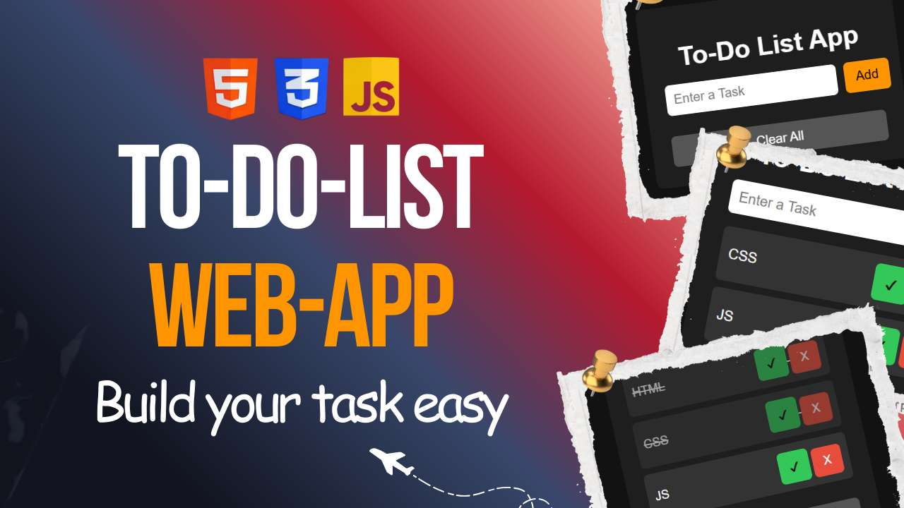

# 📋 ToDo List App — HTML, CSS & JavaScript

[](https://aarav12e.github.io/ToDoList/)
[](https://github.com/aarav12e/ToDoList)
[](https://www.youtube.com/watch?v=ooAR46vb6CU)

> A clean, functional **ToDo List Web App** built from scratch using pure **HTML**, **CSS**, and **JavaScript** — no frameworks, no libraries. Beginner-friendly and deployed live using **GitHub Pages**!

---

## 🌐 Live Demo

🔗 **[https://aarav12e.github.io/ToDoList/](https://aarav12e.github.io/ToDoList/)**

---

## 🎬 YouTube Tutorial

> **📺 Watch the full step-by-step video:** [▶ Click Here to Watch](https://www.youtube.com/watch?v=ooAR46vb6CU)

### ⏱️ Chapters
| Timestamp | Topic |
|-----------|-------|
| `00:00` | Introduction & ToDo List App Demo |
| `01:00` | Project Setup (Folder, Files & VS Code Live Preview) |
| `07:30` | JavaScript Functionality (Add, Delete, Complete & Clear Tasks) |
| `21:00` | CSS Styling & GitHub Pages Deployment |

---

## ✨ Features

- ✔️ **Add new tasks** dynamically with a single click
- ✔️ **Delete tasks** instantly
- ✔️ **Clean and responsive UI** design
- ✔️ **Real-time DOM manipulation** using JavaScript
- ✔️ **Beginner-friendly** and well-organized code structure

---

## 📌 Topics Covered

- 🏗️ HTML structure of the ToDo List
- 🎨 CSS styling, layout, and responsive design
- ⚙️ JavaScript DOM manipulation
- ➕ Add & delete task functionality
- 🖱️ Event listeners and input handling
- 🚀 GitHub upload and live deployment via GitHub Pages

---

## 🗂️ Project Structure

```
ToDoList/
├── index.html      # App structure & layout
├── style.css       # Styling & responsive design
└── script.js       # JavaScript logic (add, delete, complete tasks)
```

---

## 🚀 Getting Started

### Run Locally

1. **Clone the repository:**
   ```bash
   git clone https://github.com/aarav12e/ToDoList.git
   ```

2. **Open the project folder:**
   ```bash
   cd ToDoList
   ```

3. **Open `index.html` in your browser** — or use the [VS Code Live Preview](https://marketplace.visualstudio.com/items?itemName=ms-vscode.live-server) extension for live reload.

> No installations or dependencies needed. Just open and go! 🎉

---

## 🛠️ Built With

| Technology | Purpose |
|------------|---------|
|  | App structure |
|  | Styling & layout |
|  | DOM manipulation & logic |
|  | Live deployment |

---

## 📸 Screenshots

> *(Add screenshots of your app here)*

---

## 🤝 Contributing

Have ideas for improvements? Feel free to:

1. Fork this repo
2. Create a new branch (`git checkout -b feature/your-feature`)
3. Commit your changes (`git commit -m 'Add your feature'`)
4. Push to the branch (`git push origin feature/your-feature`)
5. Open a Pull Request

---

## 📄 License

This project is open source and available under the [MIT License](LICENSE).

---

## 🎵 Background Music (YouTube Video)

- **Track:** *Alone* by Qlowdy
- **License:** [Creative Commons — Attribution 3.0 Unported (CC BY 3.0)](https://creativecommons.org/licenses/by/3.0/)
- **Stream:** [SoundCloud](https://soundcloud.com/qlowdymusic) | [Audio Library](https://audiolibrary.com.co/qlowdy/alone)

---

<div align="center">

Made with ❤️ by [Aarav](https://github.com/aarav12e) &nbsp;|&nbsp; Happy Coding 💻🚀

⭐ **Star this repo if you found it helpful!** ⭐


</div>

